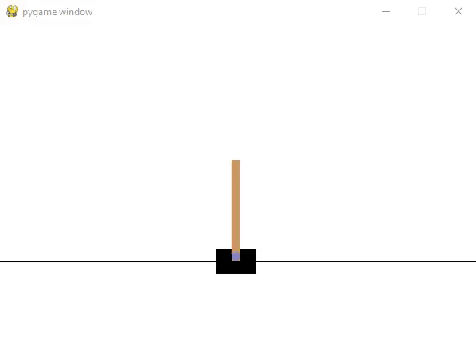

# Cart Pole Balancing Agent 
- This project contains a reinforcement learning agent that is trained to balance the pole in the classic CartPole game using a Deep Q-Network (DQN).

## Getting Started 

### Prerequisite  
- Ensure you have **Python 3.x** installed on your system. 
- You can verify your Python version with: `python --version`

### Setting up the virtual environment 
- Create a virtual environment: `python -m venv myenv`
- Activate the virtual environment: `myenv\Scripts\activate`
- Install all the third party libraries: `pip install -r requirements.txt`
 
### Run the Program
- Execute the program with: `python main.py`
- This will train a Deep Q-Networks agent in the cart pole environment from openai gym 
- Here is a sample of what you can expect to see after training the agent: 

20 episodes and 75000 training steps were used to generate this output.         
- Deactivate the virtual environment: `deactivate`

### References 
- https://github.com/openai/gym
- https://www.youtube.com/watch?v=YLa_KkehvGw&t=781s&ab_channel=NeuralNine